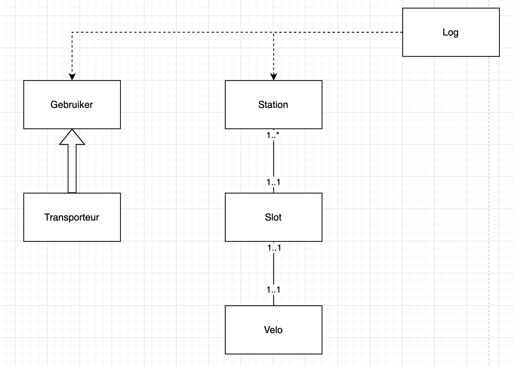

# Velo Antwerpen
Welkom bij de Velo Antwerpen applicatie!

## Werking
Via de console krijg je alle mogelijke opties om uit te voeren.
Als je het bestand uitvoert met een -s open je deze in simulatiemodus. (Tip: Je kan ook het aantal simulaties al achter de -s plaatsen bijvoorbeeld '-s 20')
Je geeft telkens het nummer van de optie die je wil selecteren.
Met deze applicatie kan je bewegingen simuleren, manueel bewegingen ingeven, 

## Features
- Simulatiemodus

Hier kies je hoevaak je een beweging gaat uitvoeren. Elke beweging begint met een gebruiker die een velo neemt van een willekeurig station die na een random aantal tijd de velo ook terug incheckt bij een ander willekeurig station.
Hierna checken we voor elk station of de transporteur minimum 18 velos heeft, zo niet geven we deze van het meest volle station. Dan checken we of het station bijna vol of bijna leeg is met een marge van 5 velos, indien dit het geval is nemen we de helft weg of we plaatsen 1/3 van beschikbare velos in het station.

- HTML Generatie

Via jinja2 HTML templates genereer ik deze paginas in een tabel met bootstrap.

- Manueel een velo in- en uit checken

Bij de manuele acties ga ik ervan uit dat je de eerste gebruiker bent, al de rest werkt in principe hetzelfde als in de simulatie modus maar dan voor 1 velo verplaatsing.
Ook kan je manueel een maintenance uitvoeren van de velo stations zodat je niet zonder velos valt op een bepaald station.

- Data opslaan en laden

Via pickle worden de object arrays opgeslagen in hun eigen file in _savedata, zodat deze kunnen opgeroepen worden later.

## Keuzes
Ik had moeilijkheden met het geojson bestand in te laden dus heb ik het via het csv formaat gedaan. 
Ik ben er vanuit gegaan dat de structuur zoals dit is.

Voor data op te slaan maak ik gebruik van Pickle zoals aanbevolen in de les maar voor de HTML te genereren heb ik gebruik gemaakt van jinja2 omdat dit me makkelijker lijkt om met templating te werken. Aangezien Dash het runnen van een soort van server is, conflicteert dit ook met de terminal interface.

Ik heb er voor gekozen om 1 transporteur te gebruiken ipv meerdere zodat het managen van het aantal velos iets makkelijker gaat. Dus die persoon krijgt van mij wel een dikke promotie.

# Moeilijkheden
Het begrijpen van de oefening is ook een moeilijkheid heb ik gemerkt, er valt veel te interpreteren op verschillende manieren.
Ik had veel moeilijkheden met het aantal velos, soms liep het station leeg, soms teveel velos in een station, de transporteur die geen velos meer had etc...
De moeilijkheid van deze opdracht zit ook wel in de details vind ik persoonlijk. Je moet op veel zaken letten of het wel mogelijk is om bijvoorbeeld een velo te plaatsen bij dat station.

# Problemen
Er blijven af en toe een paar velos verdwijnen op verschillende manieren (extreem realistisch eigenlijk dus it's not a bug, it's a feature I swear).